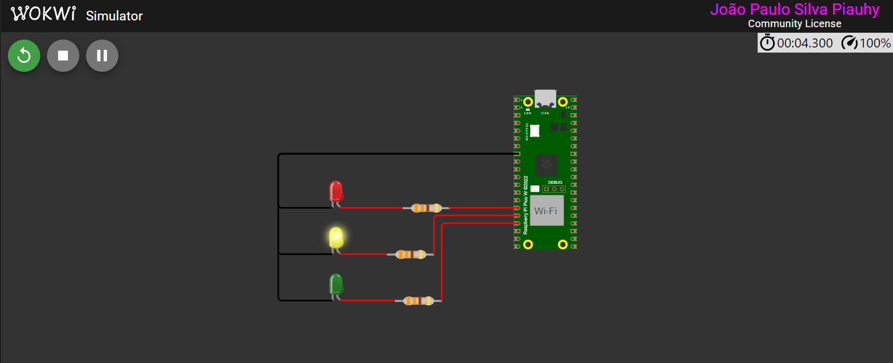

# 🚦 Semáforo com Raspberry Pi Pico W

Este projeto implementa um semáforo simples utilizando um Raspberry Pi Pico W, três LEDs (vermelho, amarelo e verde) e resistores de 330 Ω. O semáforo alterna entre as cores a cada 3 segundos, começando com o vermelho, seguido pelo amarelo e depois pelo verde. Além disso, o estado atual do semáforo é exibido na porta serial a cada segundo.

  
_(Imagem ilustrativa do semáforo em funcionamento)_

---

## 📋 Requisitos do Projeto

### Componentes Necessários

- **Microcontrolador**: Raspberry Pi Pico W
- **LEDs**: 1 vermelho, 1 amarelo e 1 verde
- **Resistores**: 3 resistores de 330 Ω
- **Protoboard e jumpers**: Para montar o circuito
- **Ferramenta de desenvolvimento**: Pico SDK, BitDogLab (para simulação)

### Funcionalidades

1. O semáforo começa com o LED vermelho aceso.
2. A cada 3 segundos, o semáforo muda para a próxima cor (amarelo, verde e volta ao vermelho).
3. O estado atual do semáforo é exibido na porta serial a cada segundo.

---

## 🛠️ Como Funciona

O projeto utiliza a função `add_repeating_timer_ms()` do Pico SDK para criar um temporizador periódico que controla a mudança de estado do semáforo. A cada 3 segundos, a função de callback é chamada, desligando todos os LEDs e acendendo o próximo LED correspondente ao estado atual.

### Fluxo de Funcionamento

1. **Estado Inicial**: LED vermelho aceso.
2. **Após 3 segundos**: LED amarelo aceso.
3. **Após mais 3 segundos**: LED verde aceso.
4. **Após mais 3 segundos**: Volta ao LED vermelho, reiniciando o ciclo.

Enquanto isso, o loop principal envia mensagens pela porta serial a cada segundo, indicando o estado atual do semáforo.

---

## 🔧 Montagem do Circuito

### Conexões

- **LED Vermelho**: Conectado ao GPIO 11 com um resistor de 330 Ω em série.
- **LED Amarelo**: Conectado ao GPIO 12 com um resistor de 330 Ω em série.
- **LED Verde**: Conectado ao GPIO 13 com um resistor de 330 Ω em série.
- **GND**: Todos os catodos dos LEDs são conectados ao GND do Raspberry Pi Pico W.

## 💻 Código do Projeto

O código foi desenvolvido em C utilizando o Pico SDK. Ele está disponível no arquivo `semaforo.c` deste repositório.

### Estrutura do Código

- **Definição dos pinos dos LEDs**.
- **Enumeração dos estados do semáforo** (vermelho, amarelo, verde).
- **Função de callback do temporizador**: Controla a mudança de estado dos LEDs.
- **Loop principal**: Envia mensagens pela porta serial a cada segundo.

### Como Compilar e Executar

1. Instale o Pico SDK e configure o ambiente de desenvolvimento.
2. Clone este repositório.
3. Compile o código usando o CMake:
   ```bash
   mkdir build
   cd build
   cmake ..
   make
   ```
4. Conecte o Raspberry Pi Pico W ao computador e carregue o arquivo `.uf2` gerado.
5. Abra um terminal serial (por exemplo, `minicom` ou `screen`) para visualizar as mensagens.

---

## 👨‍💻 Autor

- **Nome**: [João Paulo Silva Piauhy](https://www.linkedin.com/in/joaopasip/)
- **GitHub**: [Pasip](https://github.com/joao-pasip)
- **E-mail**: [joaopasip@gmail.com](mailto:joaopasip@gmail.com)

---

## 🙌 Agradecimentos

- À equipe do Raspberry Pi por desenvolver o Pico W.
- À comunidade de desenvolvedores do Pico SDK por fornecer ferramentas incríveis.
- Ao BitDogLab por facilitar a simulação de projetos embarcados.
- Ao Embarca Tech - Residência Tecnológica em Sistemas Embarcados.
- CEPEDI, Softex, Institutos Federais, UFOB e Governo Federal.

---

Espero que este projeto seja útil e inspirador! Se tiver alguma dúvida ou sugestão, sinta-se à vontade para abrir uma issue ou entrar em contato. 😊

---
